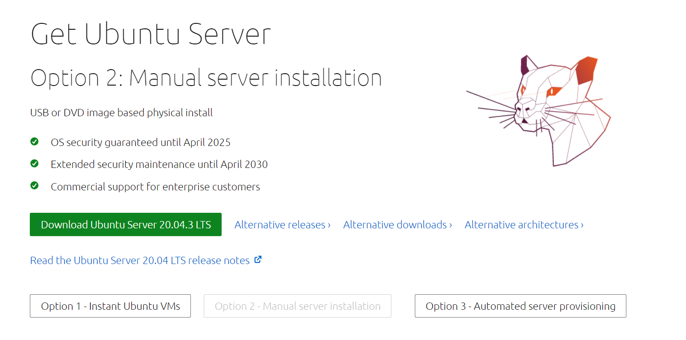
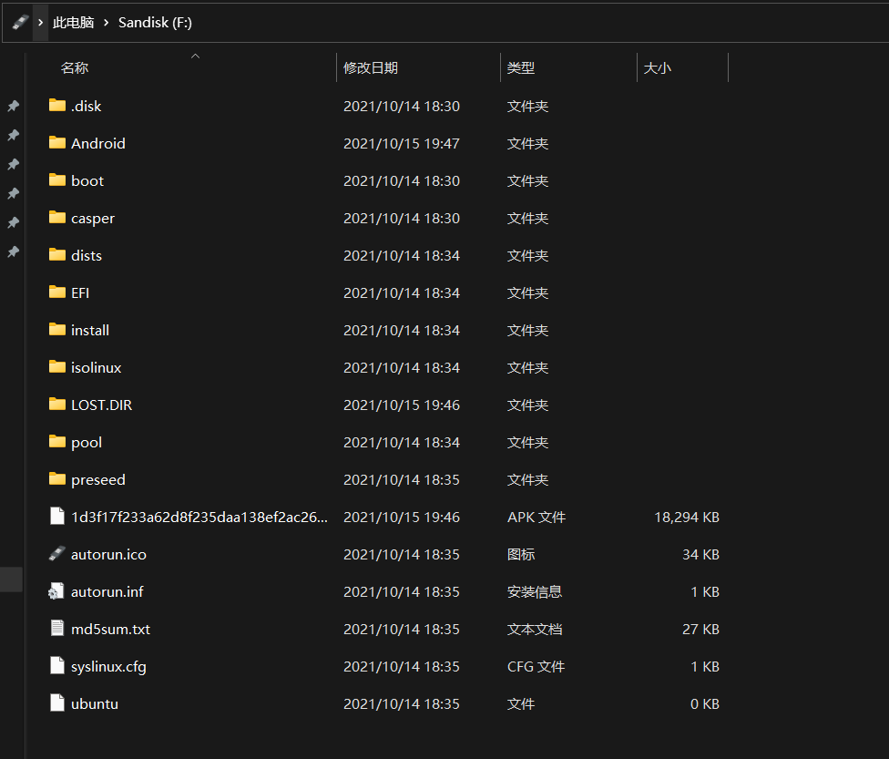

# GPU Server To Go
## 设备
- 普通U盘一个，用作ubuntu引导启动盘
- 移动硬盘/性能较好的U盘一个，用作安装Ubuntu Server
> 性价比搭配推荐  
> [绿联硬盘盒(ASM2362主控)](https://item.jd.com/100024158744.html)  
> [佳翼散热片(硅片->铜片->铝壳)](https://item.jd.com/100004807325.html)  
> [NVME固态硬盘](https://item.jd.com/100007080973.html)

## BIOS设置
进入要使用的电脑的BIOS，关闭Secure Boot(安全启动)，否则在USB设备下无法加载GPU  
若输入nvidia-smi命令会出现以下报错:  
`NVIDIA-SMI has failed because it couldn't communicate with the NVIDIA driver. Make sure that the latest NVIDIA driver is installed and running`

## 安装步骤
- 下载ubuntu server的[iso镜像](https://ubuntu.com/download/server)  
  


- 将iso内的文件拷贝入引导启动U盘中



- 同时插入启动U盘和要安装移动式系统的移动硬盘，  
  重启电脑，启动项选择U盘启动，进入ubuntu安装环节，安装盘选择移动硬盘整个磁盘。  


- 安装完成后重启电脑，启动项选择移动硬盘启动进入ubuntu server终端。 


- [装GPU驱动](https://packages.ubuntu.com/search?keywords=nvidia-driver-470-server)  
  驱动版本可以选择最新版本  
  `apt update && apt install nvidia-driver-470-server`


- 设置SSH服务  

    1. 设置root密码：  
       `sudo passwd root`
    2. root用户:  
       `su root`
    3. 修改SSH配置文件`/etc/ssh/sshd_config`  
       `PermitRootLogin yes`  
       `PasswordAuthentication yes`  
	
        或者直接用sed命令替换:  
        `sed -i "s/.*PermitRootLogin.*/PermitRootLogin yes/g" /etc/ssh/sshd_config && \`  
        `sed -i "s/.*PasswordAuthentication.*/PasswordAuthentication yes/g" /etc/ssh/sshd_config `
    4. 重启SSH服务：  
       `service sshd restart`

- 切换时区  
`export TZ="Asia/Shanghai" && ln -snf /usr/share/zoneinfo/${TZ} /etc/localtime && echo ${TZ} > /etc/timezone`


- 安装`docker`  
`curl -fsSL https://get.docker.com/ | sh && sudo service docker start && sudo systemctl enable docker.service && sudo usermod -aG docker $USER`


- 安装`docker-compose`  
`sudo curl -L "https://github.com/docker/compose/releases/download/v2.10.2/docker-compose-$(uname -s)-$(uname -m)" -o /usr/local/bin/docker-compose 
&& sudo chmod +x /usr/local/bin/docker-compose 
&& sudo ln -s /usr/local/bin/docker-compose /usr/bin/docker-compose`  
或者`apt install docker-compose`(版本稍旧)


- 安装`nvidia-docker`  
`distribution=$(. /etc/os-release;echo $ID$VERSION_ID) 
&& curl -s -L https://nvidia.github.io/nvidia-docker/gpgkey | sudo apt-key add - 
&& curl -s -L https://nvidia.github.io/nvidia-docker/$distribution/nvidia-docker.list | sudo tee /etc/apt/sources.list.d/nvidia-docker.list 
&& sudo apt-get update && sudo apt-get install -y nvidia-docker2
&& sudo systemctl restart docker`


## 注意事项
### 使用不同电脑时网络往往需要重新设置
1. 查看网络连接的名称  
   `ls /sys/class/net`


2. 修改`/etc/netplan/`下的`yml`配置文件  
   参考: https://netplan.io/examples/
> 例子
> ```
> network:   
>   ethernets:
>     eth0:
>       dhcp4: true
>       optional: true
>   version: 2
>   wifis:
>     wifi_device_name:
>       dhcp4: true
>       optional: true
>       access-points:
>         wifi_ssid_name:
>           password: "wifi_password"
> ```
>

3. `netplan --debug generate`
4. `netplan --debug apply`
5. `reboot`


### GUI和Terminal终端的切换
Ctrl + Alt + F1切换到GUI，Ctrl + Alt + F2切换到终端  


