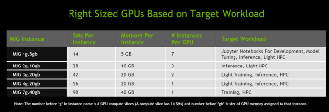
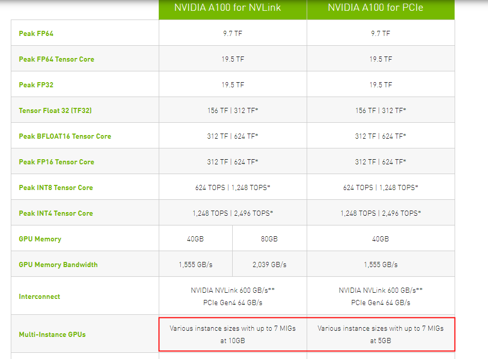
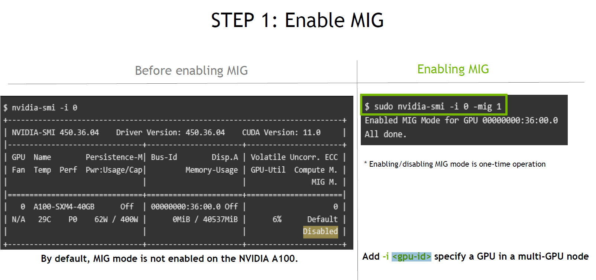
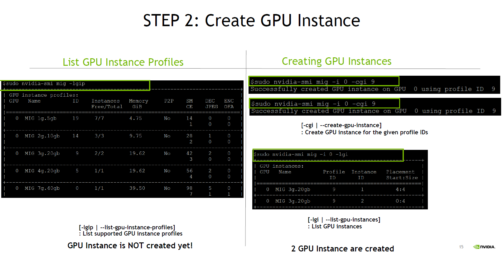
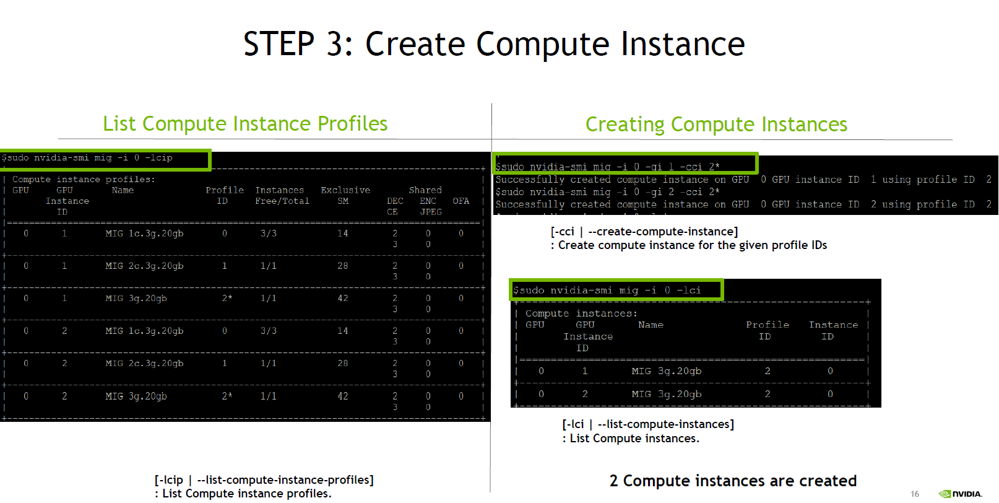

# Multi-Instance GPU
NVIDIA从安培架构开始支持更细粒度的GPU资源划分  

## 介绍
以A100 40GB显存为例，A100一张卡的SM单元(streaming multiprocessor)数量(类似CPU的核心数)为108，一个GPU运算实例的最小粒度是14个SM单元，
也就是说在分配GPU的SM单元数量时必须是14的整数倍。如果申请规模为28 SM单元数，10GB显存的运算实例，设在单张A100上这样的实例个数最多为X个，
那么必须满足28 * X <= 108(SM单元总数限制) 且 10 *X <= 40(GPU显存限制)，所以X最大为3。
每14个SM单元称作一个Slice，每张A100卡有7个Slice。

  

  

## nvidia-smi mig
- 启用MIG  
`nvidia-smi -mig 1`

- 启用某个GPU的MIG，<gpu-id>为GPU编号  
`nvidia-smi -i <gpu-id> -mig 1`

> **注意**:  
> 后面所有MIG命令中都可用-i 来指定作用于哪张卡(8张A100卡的ID依次为0~7)

  

## 创建GPU实例
**启用MIG后才能创建GPU实例**

罗列所有卡的GPU实例配置规格，表格中的ID表示使用哪种规格，比如19表示使用1g.5gb规格实例(1 slice and 5 GB 显存)，参考此表来创建GPU实例  
`nvidia-smi mig -lgip`  

罗列所有卡的已创建GPU实例  
`nvidia-smi mig -lgi`   

> **注意**:  
> 创建GPU实例时，可用`-i` 来指定作用于哪张卡(8张A100卡的ID依次为0~7)，例如  
> `nvidia-smi mig -i 0 -cgi 19,14` 表示在卡0上分别创建规格为1g.5gb和2g.10gb的两个实例，命令中的逗号不能空格。  
> 
> 如果不指定`-i`则默认作用于所有卡，例如  
> `nvidia-smi mig -cgi 19,19,19,19,19,19,19` 表示在8张A100上创建7*8=56个1g.5gb规格实例。

## 创建运算实例
**创建GPU实例后才能具体给某个GPU实例分配运算实例，只有给GPU实例创建了运算实例才会真正占用GPU资源**

罗列所有卡的运算实例配置规格，表格中的Profile ID表示使用哪种规格  
`nvidia-smi mig -lcip`

罗列所有卡的已创建运算实例  
`nvidia-smi mig -lci`

> **注意**:  
> 创建运算实例时，可用`-i` 来指定作用于哪张卡(8张A100卡的ID依次为0~7)，例如  
> `nvidia-smi mig -i 0 -gi 1,2 -cci 2*` 表示在卡0上分别给GPU实例ID为1和2的两个GPU实例创建规格为2*的运算实例，命令中的逗号不能空格。 
> 
> 如果不指定`-i`则默认作用于所有卡，不指定`-gi`则默认作用于该卡的所有GPU实例，例如  
> `nvidia-smi mig -cci` 表示在8张A100上给所有GPU实例分配与GPU实例规格相对应的运算实例。 

## 删除运算实例
- 删除所有GPU实例: `nvidia-smi mig -dci` 
- 删除卡0的所有GPU实例: `nvidia-smi mig -i 0 -dci`  

## 删除GPU实例
**先删除运算实例才能删除对应的GPU实例**  
- 删除所有运算实例: `nvidia-smi mig -dgi`
- 删除卡0的所有运算实例: `nvidia-smi mig -i 0 -dgi`

## 测试例子
- 开启MIG，创建56个1g.5gb规格实例(1 slice and 5 GB 显存)并分配对应的运算实例  
`nvidia-smi -mig 1`  
`nvidia-smi mig -cgi 19,19,19,19,19,19,19`    
`nvidia-smi mig -cci`  

- 删除所有实例  
`nvidia-smi mig -dci && nvidia-smi mig -dgi`

- 关闭MIG  
停止使用了GPU的容器后, 执行`nvidia-smi -mig 0`

- 指定MIG实例  
`device=0:6` 表示使用0卡的实例ID为6的MIG实例，多个实例用逗号分隔

## 参考资料
- https://developer.nvidia.com/blog/minimizing-dl-inference-latency-with-mig/
- https://developer.nvidia.com/blog/getting-the-most-out-of-the-a100-gpu-with-multi-instance-gpu/
- https://docs.google.com/document/d/13LyeFxuWLSwDjCXKx7RyWWRZEAqA-mghtK3GRPvGv1s/edit#
- https://resource.gtcevent.cn/gtc2020/pdf/CNS20428.pdf
- https://resource.gtcevent.cn/gtc2020/pdf/CNS20268.pdf
